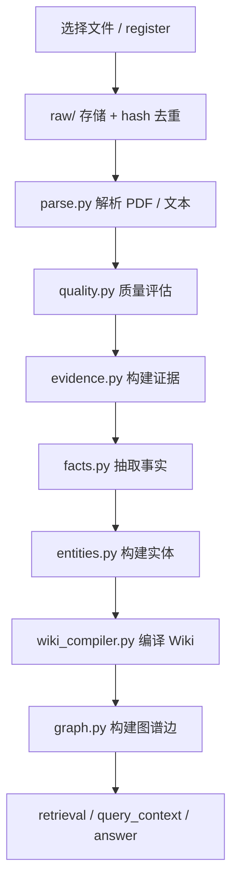
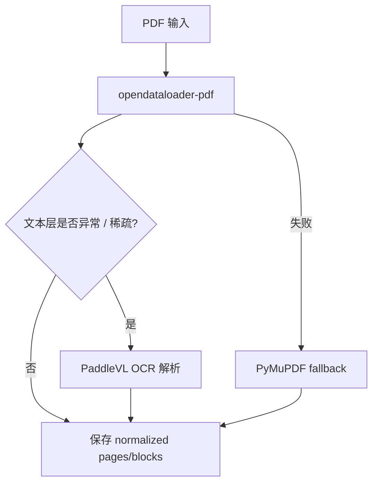
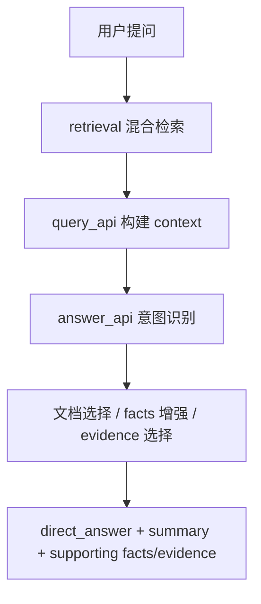
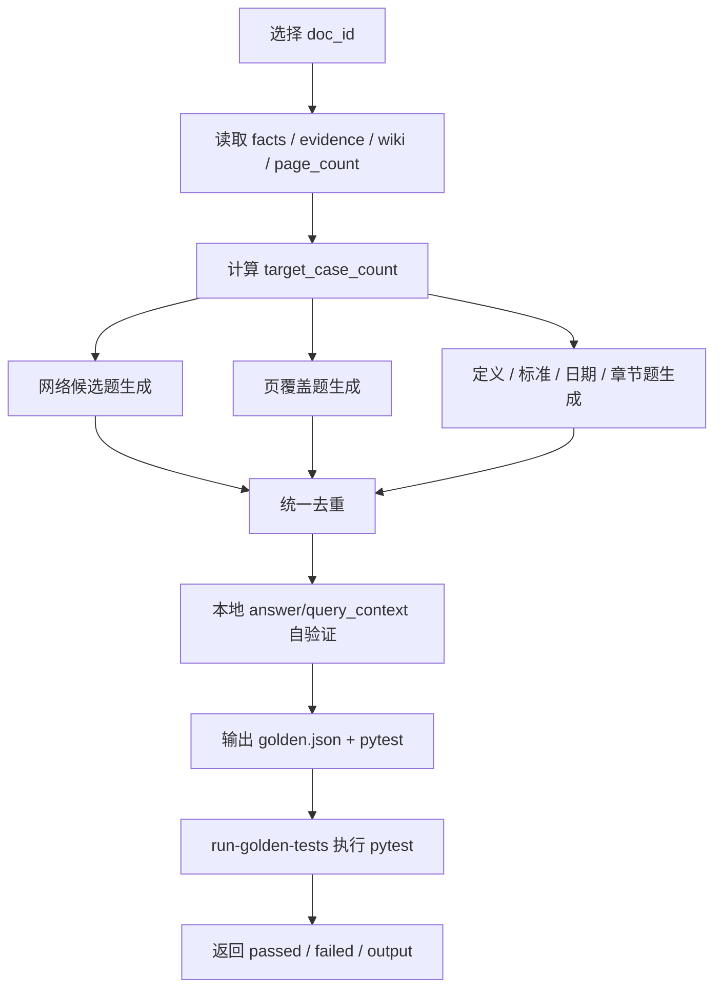

# Enterprise Agent KB 系统架构与功能总结

## 1. 文档目的

本文档总结当前 `Enterprise Agent KB` 项目已经实现的技术架构、功能能力、端到端处理流程、接口形式、测试与验证能力，以及当前已知边界。  
目标是把当前项目从“可运行 demo”沉淀为“可维护的工程化知识库系统说明”。

---

## 2. 当前项目目标

当前项目面向“企业知识库 / 标准文档知识库 / Agent 可调用知识底座”场景，重点解决以下问题：

- 原始文档接入与管理
- PDF 文档解析与 OCR 兜底
- 质量评估与风险页识别
- 证据、事实、实体、Wiki、图谱的结构化构建
- 可解释检索与问答
- Demo 工作台的导入、构建、验证、查询闭环
- 黄金测试集自动生成与执行

项目当前是**单机版本**，以 SQLite + 本地文件工作区为主，不依赖分布式基础设施。

---

## 3. 总体技术架构

### 3.1 分层结构

系统可以划分为 7 层：

1. 接入层
   - CLI
   - HTTP API
   - MCP Server
   - Demo Web UI
2. 工作区与存储层
   - `knowledge_base/` 目录结构
   - SQLite 数据库 `knowledge_base/db/knowledge.db`
3. 文档处理层
   - register / parse / quality
4. 结构化知识构建层
   - evidence / facts / entities / wiki / graph
5. 检索与问答层
   - retrieval / query_context / answer_query / agent_query
6. 测试与验证层
   - golden tests 生成
   - golden tests 执行
   - pytest 回归
7. 审计与运维层
   - job history
   - audit log
   - health/status

### 3.2 核心模块映射

| 模块 | 文件 | 责任 |
|---|---|---|
| CLI | `src/enterprise_agent_kb/cli.py` | 命令入口 |
| Workspace 初始化 | `bootstrap.py` | 工作区目录与 DB 初始化 |
| 存储配置 | `config.py` | 工作区路径管理 |
| DB | `db.py`, `schema.sql` | SQLite 连接与 schema |
| 接入注册 | `ingest.py` | 文档注册、去重、落 raw |
| 解析 | `parse.py` | PDF / 文本解析 |
| 质量评估 | `quality.py` | 页面风险与质量报告 |
| 证据构建 | `evidence.py` | 从页面块到 evidence |
| 事实构建 | `facts.py` | metadata / term / section 等事实抽取 |
| 实体构建 | `entities.py` | 文档、标准、术语实体 |
| Wiki | `wiki_compiler.py` | 标准页、术语页、文档页 |
| 图谱 | `graph.py` | 实体关系边 |
| 检索 | `retrieval.py`, `synonyms.py` | FTS + 轻量语义 + 同义扩展 |
| 上下文构建 | `query_api.py` | 结构化 query context |
| 问答 | `answer_api.py` | 直接答案与可解释摘要 |
| Agent 查询 | `agent_tools.py` | 多步 query 调用 |
| HTTP API | `api_server.py` | 本地接口与 job 驱动 |
| MCP | `mcp_server.py` | stdio MCP 工具暴露 |
| 流水线 | `pipeline.py` | 端到端串联 |
| 黄金集 | `generated_tests.py` | 生成与执行黄金测试 |

---

## 4. 数据与存储设计

### 4.1 工作区目录结构

当前默认工作区为：

```text
knowledge_base/
├── raw/
├── normalized/
├── evidence/
├── facts/
├── wiki/
├── review_queue/
├── quality_reports/
├── logs/
└── db/
    └── knowledge.db
```

### 4.2 数据演化链路

系统严格遵循以下链路：

`raw document -> pages/blocks -> evidence -> facts -> entities/wiki/graph -> retrieval -> answer`

这条链路满足项目约束：

- `evidence` 到 `facts` 到 `wiki` 可追溯
- 每个阶段保留质量/风险元数据
- 支持增量重建，不依赖 destructive reset

### 4.3 数据库中的核心对象

核心表包括但不限于：

- `documents`
- `parse_jobs`
- `pages`
- `blocks`
- `quality_reports`
- `evidence`
- `facts`
- `fact_evidence_map`
- `entities`
- `wiki_pages`
- `graph_edges`

---

## 5. 文档接入与解析能力

### 5.1 文档接入

当前支持：

- PDF
- Markdown / 文本类文件

接入时会执行：

- 文件复制到 `raw/`
- hash 去重
- 生成 `doc_id`
- 写入 `documents`

### 5.2 PDF 解析策略

当前 PDF 解析采用多级策略：

1. 优先使用 `opendataloader-pdf`
2. 对“图片型 PDF / 文本层异常 PDF / OCR 稀疏 PDF”自动切换到 PaddleVL 路径
3. 若上述失败，再降级到 PyMuPDF 文本抽取

### 5.3 OCR 与异常 PDF 处理

目前已经实现：

- 文本稀疏检测
- OCR 异常字符比例检测
- 全角/错字归一化
- 图片型 PDF 二级解析器（PaddleVL）

这套逻辑已经用于真实标准文档回归：

- `GBT+18487.1-2023.pdf`
- `GB_T 18487.5-2024 ...pdf`
- `GBT+40432-2021.pdf`
- `V2G相关.pdf`
- `QC_T 1036-2016 汽车电源逆变器...pdf`

---

## 6. 质量评估与风险控制

质量层负责给解析结果打风险标签，形成质量报告。

### 当前已实现能力

- 页面质量评分
- 高风险页统计
- `review_required / blocked / passed` 状态
- 风险页进入后续 warning 提示

### 当前用途

- 在问答时对低质量文档给出 warning
- 在文档详情中展示质量分、风险页数量
- 作为 evidence / fact 可信度的重要输入

---

## 7. 结构化知识构建

### 7.1 Evidence

`evidence.py` 将解析出的页面块转为可引用证据，保留：

- `doc_id`
- `page_no`
- `normalized_text`
- `confidence`
- `risk_level`

### 7.2 Facts

`facts.py` 负责从 evidence 中抽取结构化事实，当前已覆盖：

- 文档标准号 `document_standard`
- 标题 `document_title`
- 发布/实施日期 `document_lifecycle`
- 章节标题 `section_heading`
- 术语定义 `term_definition`
- 概念定义 `concept_definition`
- 摘要 `document_abstract`

已做的典型增强：

- 支持 `QC/T` 这类标准号抽取
- 支持 `3.1 -> 术语行 -> 定义行` 版式的术语抽取
- 支持摘要中的 `V2G` 概念定义抽取

### 7.3 Entities

`entities.py` 将事实进一步挂接到实体，目前主要包含：

- document
- standard
- term

### 7.4 Wiki

`wiki_compiler.py` 将结构化结果编译为本地 Wiki 页面：

- 文档页
- 标准页
- 术语页

### 7.5 Graph

`graph.py` 当前已支持的主要边包括：

- document -> references_standard
- document -> replaces_standard
- document -> defines_term

---

## 8. 检索与问答架构

### 8.1 检索层

检索由 `retrieval.py` 实现，当前是混合检索：

- SQLite FTS5
- CJK n-gram 扩展
- 轻量语义相似度
- 同义词扩展

### 8.2 Query Context

`query_api.py` 将检索结果扩展为结构化上下文，包含：

- `documents`
- `hits`
- `evidence`
- `facts`
- `entities`
- `graph_edges`
- `wiki_pages`

### 8.3 Answer 层

`answer_api.py` 当前支持：

- 标准号问答
- 定义问答
- 一般检索问答
- 证据/事实可解释返回

### 8.4 已做的关键召回修正

已实现的召回/问答修正包括：

- 同义词扩展解决“充电导引”召回
- `QC/T` 标准号识别
- `V2G` 定义问法识别
- `V2V` 这类库中不存在的缩写不再误召回到无关章节

### 8.5 当前示例

当前真实表现：

- `什么是V2G`
  - 能返回定义
- `V2G是怎么定义的`
  - 能返回定义
- `什么是V2V`
  - 返回无结果
- `V2V是怎么定义的`
  - 返回无结果

---

## 9. Agent 能力

当前已经不是单纯的 RAG 检索器，而是具备了“结构化 query + answer orchestration”的 Agent 能力雏形。

### 已实现能力

- `agent_query`
- 多步调用 `search / query_context / answer_query`
- 最终输出 plan、tool_results、final_answer

### 与纯 RAG 的区别

当前系统不是“向量检索 + 大模型直接生成”的纯 RAG，而是：

- 有显式的结构化知识中间层
- 有 evidence / fact / wiki / graph 分层
- 可做事实优先、定义优先、标准优先的规则化回答
- 更适合审计、回溯和工程化验证

---

## 10. HTTP API 能力

当前本地 API 已支持：

### 查询接口

- `GET /health`
- `POST /search`
- `POST /query-context`
- `POST /answer-query`
- `POST /agent-query`

### 文档与流水线接口

- `GET /documents`
- `POST /document-detail`
- `POST /build-document`
- `POST /upload-build`
- `POST /start-build-document`
- `POST /start-upload-build`
- `POST /job-status`
- `GET /jobs`

### 测试与审计接口

- `POST /generate-golden-tests`
- `POST /run-golden-tests`
- `GET /audit-log`

### Demo 页面

- `GET /demo`

---

## 11. Demo 工作台当前功能

当前 demo 页面已经不是单纯问答框，而是完整工作台。

### 已实现页面功能

- 中文界面
- 文件上传
- 上传并构建
- 已有文档重建
- 文档列表筛选
- 文档详情查看
- 查询与问答
- 最近任务列表
- 审计日志
- 黄金测试生成
- 黄金测试执行
- 黄金测试覆盖情况展示
- 黄金测试执行结果展示

### 页面可见指标

- 服务健康状态
- 当前任务阶段与进度
- 文档页数 / 证据 / 事实 / 图谱边
- 黄金集目标条数 / 实际条数 / 页覆盖数 / 未覆盖页
- 黄金测试通过数 / 失败数 / pytest 输出

---

## 12. 黄金测试集系统

这是当前系统里已经工程化落地的一块关键能力。

### 12.1 已实现目标

- 自动生成黄金测试集
- 按页覆盖优先生成
- 最低不少于 `20` 条
- 支持网络优先 + 本地回填
- 支持生成后自验证
- 支持一键执行 pytest

### 12.2 当前生成逻辑

黄金测试集生成位于 `generated_tests.py`，当前流程为：

1. 根据页数和内容密度计算目标条数
2. 优先尝试网络来源生成候选题
3. 从 evidence 中生成页覆盖题
4. 再补定义、标准、日期、章节、上下文题
5. 对所有候选题做本地真实可执行验证
6. 只保留当前知识库真实能命中的题
7. 输出 JSON 与 pytest 文件

### 12.3 当前执行逻辑

`run_golden_tests_for_document()` 会执行生成后的 pytest 文件，并返回：

- `passed`
- `failed`
- `success`
- `return_code`
- `output`

### 12.4 当前效果

示例：

- `DOC-000007`
  - `case_count = 28`
  - `page_coverage_count = 14`
  - `uncovered_pages = []`
  - `run-golden-tests -> 28 passed`

- `DOC-000006`
  - `case_count = 20`
  - `page_coverage_count = 10`
  - `uncovered_pages = []`
  - `run-golden-tests -> 20 passed`

### 12.5 当前限制

“每页至少覆盖一条”当前统计口径是：

- 覆盖**有可检索 evidence 的内容页**
- 不是 PDF 原始物理页的逐页 OCR 强覆盖

也就是说，空白页、极弱内容页、未生成 evidence 的页，不计入当前覆盖统计。

---

## 13. MCP 能力

当前支持 stdio MCP Server：

- `search`
- `query_context`
- `answer_query`
- `agent_query`
- `build_document`

这使得外部 Agent / MCP Client 可以把本知识库作为工具节点使用。

---

## 14. 端到端流程图

### 14.1 文档入库流程



### 14.2 PDF 多级解析流程



### 14.3 查询与问答流程



### 14.4 黄金测试集生成与执行流程



---

## 15. 当前测试体系

当前测试分为三层：

### 15.1 单元测试

- API 基本行为
- 交付资产存在性

### 15.2 集成测试

- 真实 PDF 管线回归
- 新文档回归
- 真实问答回归

### 15.3 Benchmark / Golden

- 标准号问答
- 术语定义问答
- 自动生成黄金测试
- 黄金测试执行

当前已经多次跑通：

- `tests/test_api_server.py`
- `tests/test_new_docs_regression.py`
- `tests/test_golden_answers.py`
- `tests/generated/test_doc_000006_golden.py`
- `tests/generated/test_doc_000007_golden.py`

---

## 16. 当前已知边界

### 16.1 召回边界

- 术语不存在时会返回无结果，但前提是术语形式足够明确
- 对极短 query 或模糊 query，仍可能召回到相邻概念或章节

### 16.2 黄金集边界

- 当前网络候选题会参与生成，但最终是否保留取决于本地知识库能否实际命中
- 因此“网络候选数”与“最终网络入选数”可能不同

### 16.3 页覆盖边界

- 当前覆盖口径是“有证据页”
- 不是“原始 PDF 每物理页 100% 覆盖”

### 16.4 前端边界

- Demo 已经工程化，但还不是正式产品 UI
- 部分状态标签仍保留技术态文本（如 parse/quality 枚举值）

---

## 17. 当前结论

到目前为止，这个项目已经不再是简单的 PDF 问答 demo，而是具备以下能力的工程化知识库系统：

- 可接入真实标准文档
- 可处理复杂 PDF 与 OCR 场景
- 可形成 evidence/facts/wiki/graph 结构化层
- 可做可解释检索与问答
- 可通过 HTTP / MCP / Demo 页面访问
- 可生成并执行黄金测试集
- 具备基础审计、任务追踪、质量评估能力

当前系统已经形成了一个可继续扩展的单机版知识底座。

后续如果继续升级，建议优先方向是：

1. 物理页级强覆盖黄金集
2. 更强的定义类精确召回
3. 检索 reranker / query rewrite
4. 页面更产品化
5. 更完整的审计导出与失败分析

